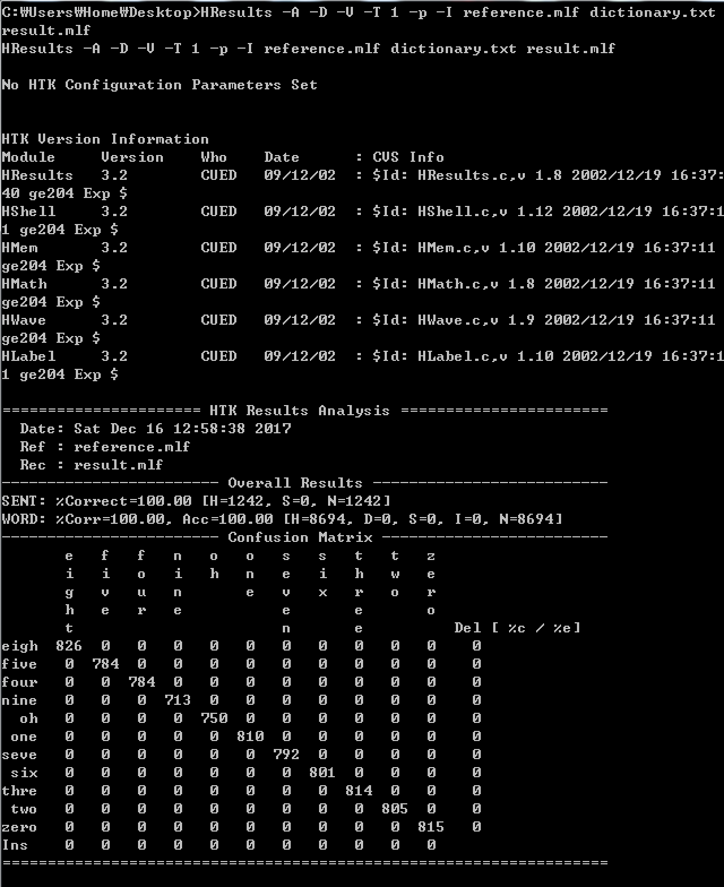

## ASR_2017_ml 

#### 2016320014 김세희

**모든 파일은 http://github.com/say2 에 공개되어 있습니다.**

1. 주어진 데이터/파일

* hmm.h(hmm.txt) : 음성파일에 HMM(Hidden Markov Model)과 GMM(Gaussian Mixture Model)으로 가공한 데이터. hmm.h은 hmm.txt 값을 토대로 c의 헤더파일을 만든 것.
* dictionary.txt : 결과값 단어(one two…)를 syllable(음절)로 분해한 값
* bigram.txt : 단어 -> 단어로 갈 확률 데이터
* unigram.txt : 시작 -> 단어로 갈 확률 데이터
* reference.txt : 실제 음성값
* HResults.exe : 내가 알고리즘을 적용하여 도출해낸 결과값을 실제 음성값(reference.txt)을 이용하여 정확도를 검증하기 위한 파일

2. TO DO
   * hmm.h, dictionary.txt, bigram.txt unigram.txt 를 이용하여 tst폴더에 있는 데이터를 해석하여 문장을 알아낸다. 
   * HResult.exe를 이용하여 정확도를 검증한다.

3. Coding

   1. dictionary.txt, bigram.txt, unigram.txt에 있는 값들을 가져온다. (unigram은 사용하지 않았다,bigram을 사용)
   2. 학습 데이터를 가져온다. python script로 파일명을 추출하여 filename.txt로 저장한 다음 이 파일을 읽어서 사용
   3. ​hmm transport table을 만든다.
   4. viterbi알고리즘을 이용하여 최대 확률을 가지는 state를 구한다.
      - 각 시간의 흐름(데이터의 순서)에서 P(x|state)를 구한다. (가우시안 혼합모델과 확률 밀도 함수 P(x|m,v)를 적용하여 데이터를 가공해 확률을 계산한다. )
      - 최종 시간에서 가장 확률이 높은 state에서 반대로 tracing한다.
      - 구한 state의 순서로 word를 구한다. 

4. 기타

   - 사용한 언어 : C++
   - os : osx
   - result.txt에서 개행을 처리해줘야(0A->0D0A) Hresult.exe 동작

   ​

   

